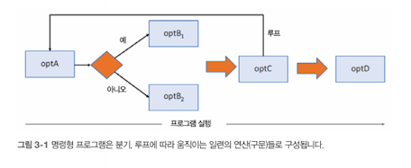
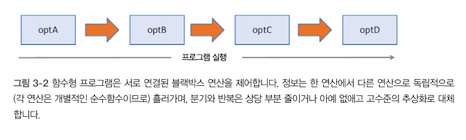

# 자료구조는 적게, 일은 더 많이

## 이 장의 내용
- 프로그램 제어와 흐름
- 코드와 데이터를 효과적으로 헤아림
- map, reduce, filter의 진면목
- 로대시JS 라이브러리와 함수 체인
- 재귀적 사고방식

## 3.1 애플리케이션의 제어 흐름
- 프로그램이 정답에 이르기까지 거치는 경로를 **제어 흐름**이라고함
- 명령형 프로그램은 작업 수행에 필요한 전 단계를 노출하여 흐름이나 경로를 아주 자세히 서술함
- ex)
```jsx
var loop = opt()
while (loop) {
  var condition = optA();
  if (condition) {
    optB1();
  } else {
    optB2();
  }
  loop = opt();
}
opt();
```

- 반면 선언적 프로그램 특히 함수형 프로그램은 독립적인 블랙박스 연산들이 단순하게 최소한의 제어 구조를 통해 연결되어 추상화 수준이 높음

- 덕분에 다음과 같이 코드가 짧아지고 연산을 체이닝 하면서 표현적인 형태로 프로그램을 작성할 수 있어 제어 흐름과 계산 로직을 분리할 수 있고 코드와 데이터를 더욱 효과적으로 헤아릴 수 있음
- ex)
```jsx
optA().optB().optC().optD()
```

## 3.2 메서드 체이닝
- 메서드 체이닝은 여러 메서드를 단일 구문으로 호출하는 OOP 패턴
```jsx
'Functional Programing'.substring(0, 10).toLowerCase() + ' is fun';
```
를 함수형으로 리팩토링한 코드는 다음과 같음
```jsx
concat(toLowerCase(substring('Functional Programing', 1, 10)), ' is fun');
```
- 매개변수는 모두 함수 선언부에 명시해서 부수효과를 없애고 원본 객체를 바꾸지 않아야 한다는 함수형 교리를 충실히 반영함
- 그러나 함수 코드를 안쪽에서 바깥쪽으로 작성하면 메서드 체이닝 방식만큼 매끄럽지 못함
- 로직을 파악하려면 가장 안쪽에 감싼 함수부터 한 껴풀씩 벗겨내야 하고 가독성도 현저히 떨어짐

## 3.3 함수 체이닝
- 객체지향 프로그램은 주로 상속을 통해 코드를 재사용함 ex) List -> ArrayList, LinkedList, DoublyLinkedList, ...
- 함수형 프로그래밍은 자료구조를 새로 만들어 어떤 요건을 충족시키기는게 아니라 배열 등의 흔한 자료구조를 이용해 다수의 굵게 나뉜 고계 연산을 적용함
- 이러한 고계 연산으로 다음과 같은 일을 해야함
  - 작업을 수행하기 위해 무슨일을 해야하는지 기술된 함수를 인수로 받음
  - 임시 변수의 값을 계속 바꾸면서 부수효과를 일으키는 기존 수동 루프를 대처함. 그 결과 관리할 코드가 줄고 에러가 날 만한 코드 역시 줄어듬

## 3.3.1 람다 표현식
- 함수형 프로그래밍에서 탄생한 **람다 표현식**은 한 줄짜리 익명 함수를 일반 함수 선언보다 단축된 구문으로 나타냄
- 함수형 프로그래밍은 람다 표현식과 잘 어울리는 세 주요 고계함수 map, reduce, filter를 적극 사용할 것을 권장함

## 3.3.2 _.map: 데이터를 변환
배열 각 원소에 이터레이터 함수를 적용하여 크기가 같은 새 배열을 반환하는 고계함수
```jsx
function map(arr, fn) {
  // 배열과 함수를 인수로 받아 배열 원소마다 함수를 실행하고 원본과 크기가 같은 새 배열을 반환
  const len = arr.length,
    // 입력받은 배열과 크기가 동일한 배열 result를 선언함
    result = new Array(len)
  for (let idx = 0; idx < len; ++idx) {
    // 함수 fn을 각 원소에 실행하고 그 결과를 배열에 도로 담음
    result[idx] = fn(arr[idx], idx, arr)
  }
  return reulst;
}
```

## 3.3.3 _.reduce: 결과를 수집
원소 배열을 하나의 값으로 짜내는 고계함수로, 원소마다 함수를 실행한 결괏값의 누적치를 계산함
```jsx
function reduce(arr, fn, accumulator) {
  let idx = -1,
    len = arr.length
  // 누산치를 지정하지 않으면 배열의 첫번째 원소를 초깃값으로 삼음
  if (!accumulator && len > 0) {
    accumulator = arr[++idx];
  }
  while (++idx < len) {
    // 배열을 반복하면서 원소마다 누산치, 현재 값, 인덱스, 배열을 인수로 fn을 실행함
    accumulator = fn(accumulator, arr[idx], idx, arr)
  }
  return reulst;
}
```

## 3.3.4 _.filter: 원하지 않는 원소를 제거
배열 원소를 반복하면서 술어 함수 p가 true를 반환하는 원소만 추려내고 그 결과를 새 배열에 담아 반환하는 고계함수
```jsx
function reduce(arr, fn, accumulator) {
  let idx = -1,
    len = arr.length
  // 누산치를 지정하지 않으면 배열의 첫번째 원소를 초깃값으로 삼음
  if (!accumulator && len > 0) {
    accumulator = arr[++idx];
  }
  while (++idx < len) {
    // 배열을 반복하면서 원소마다 누산치, 현재 값, 인덱스, 배열을 인수로 fn을 실행함
    accumulator = fn(accumulator, arr[idx], idx, arr)
  }
  return reulst;
}
```

### 배열 축약
map, filter의 기능을 각각 for..of 와 if 키워드를 이용하여 단축된 구문으로 캡슐화하는 함수형 장치
[for (x of 이터러블) if (조건) x]

## 3.4 코드 헤아리기
프로그램의 일부만 들여다봐도 무슨 일을 하는 코드인지 멘털 모델을 쉽게 구축할 수 있음

멘터 모델 - 전체 변수의 상태와 함수 출력 같은 동적인 부분뿐만 아니라 설계 가독성 및 표현성 같은 정적인 측면까지 포괄하는 개념

## 3.5 재귀적 사고 방식
순수 함수는 루프 구조가 없기에 배열등을 탐색할 때 재귀는 필수

## 3.5.1 재귀란?
재귀는 주어진 문제를 자기 반복적인 문제들로 잘게 분해한 다음 이들을 다시 조합해 원래 문제의 정답을 찾는 기법
- 기저케이스: 재귀함수가 구체적인 결괏값을 바로 계산할 수 있는 입력 집합
- 재귀 케이스: 함수가 자신을 호출할 때 전달한 입력 집합

## 3.5.2 재귀적으로 생각하기
재귀적 사고란 자기 자신 또는 그 자신을 변형한 버전을 생각하는 것

## 마치며
- 고계함수 map, reduce, filter를 쓰면 코드를 확장할 수 있음
- 로대시 JS는 데이터 흐름과 변환 과정이 명확히 구획된 제어 체인을 통해 데이터 처리 및 프로그램 작성을 도모
- 함수형 프로그래밍의 선언적 스타일로 개발하면 코드를 헤아리기 쉬움
- 고수준의 추상화를 SQL 어휘로 매핑하면 더 심도 있게 데이터를 이해할 수 있음
- 재귀는 자기 반복적 문제를 해결하는데 쓰이며, 정의된 자료구조를 재귀적으로 파싱해야함


