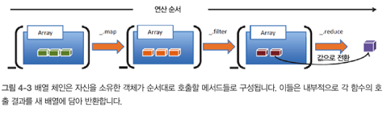
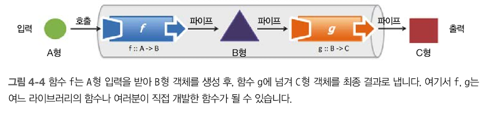

# 재사용 가능한, 모듈적인 코드로


## 이장의 내용
- 함수 체인과 함수 파이프라인 비교
- 함수형 라이브러리 람다 JS 소개
- 커링, 부분 적용, 함수 바인딩 개념 탐구
- 함수 합성으로 모듈적인 프로그램 제작
- 함수 조합기로 프로그램의 흐름을 개선

## 4.1 메서드 체인 대 함수 파이프라인
- 함수 체이닝과 파이프라이닝을 이해하려면 함수를 형식 간의 매핑으로 바라봐야 함
- 메서드 체이닝 (단단한 결합, 제한된 표현성)
- 함수 파이프라인을 배열 (느슨한 결합, 유연성)

### 4.1.1 메스드를 여럿 체이닝
map과 filter 함수는 배열을 넘겨받아 새 배열을 돌려줌
암시적으로 생성된 LoadshWrapper 객체를 매개로 이들 함수를 체이닝 하면 물밑에서 전혀 새로운 자료구조를 만듬
```jsx
_.chain(names)
  .filter(isValid)
  .map(s => s.replace(/_/, ''))
  .uniq()
  .map(_.startCase())
  .sort()
  .value();
```

명령형 코드에 비해 구조적으로 향상 됐고 가독성도 엄청 좋아짐
다만 자신을 소유한 객체에부자연스럽게 매여 있어 아쉽게도 체인에서 실행 가능한 메서드 가짓수가 줄고 코드의 표현성도 제약 받음
이 예제는 로대시JS가 제공하는 연산만 쓸 수 있기 때문에 다른 라이브러리 함수를 쉽게 연결할 수 없음


### 4.1.2 함수를 파이프 라인에 나열
파이프라인이란 한 함수의 출력이 다음 함수의 입력이 되게끔 느슨하게 배열한, 방향성 함수 순차열

체이닝은 객체 메서드를 통해 함수들을 단단히 결합하지만 파이프라인은 함수 입출력을 서로 연결지어 느슨하게 결합된 컴포넌트를 만듬 단 함수의 항수와 형식이 호환되지 않으면 연결할 수 없음

## 4.2 함수 호환 요건
객체지향 프로그램에서는 파이프라인을 특정한 경우(보통인증/인가처리)에 드문드문 사용하지만 함수형 프로그래밍에서는 파이프라인이 프로그램을 구축하는 유일한 수단
일을 하다 보면 대부분 정의된 문제와 그 해결 방안 간에 차이점이 생기게 마련이므로 단계별로 명확하게 정의된 계산을 해야 함
이 계산 단계가 코드에서는 함수로 표현되는데 각 함수는 두가지 측면에서 입력과 출력이 서로 호환돼야 함
형식: 한 함수의 반환 형식과 수신 함수의 인수 형식이 일치해야 함
항수: 수신 함수는 앞 단계 함수가 반환한 값을 처리하기 위해 적어도 하나 이상의 매개 변수를 선언해야 함

### 4.2.1 형식이 호환되는 함수
함수 파이프라인을 설계할 때에는 한 함수가 반환하는 것과 다른 함수가 받는 것이 반드시 호환되어야 함
형식은 정적 형식 언어세는 큰 관심사이지만 자바스크립트는 형식이 느슨한 언어라서 그렇지 않음
따라서 어떤 객체가 실제로 특정 형식처럼 작동하면 그 형식은 그냥 그 객체의 형식인 것
이를 다른말로 덕 타이핑이라 함("오리처럼 걷고 오리처럼 말하는 동물이 있다면 그것은 다름아닌 오리다")
자바스크립트는 동적 파견 체제 덕분에 형식과 무관하게 객체에서 속성과 메서드를 가져올 수 있음
매우 유연한 구조지만 함수가 어떤 형식의 값을 기대하는지 알아야 할 때가 있어서 형식을 명확하게 정의하면 프로그램을 이해하는게 더 쉬워짐
```jsx
// trim :: String -> String
const trim = (str) => str.replace(/^\s*|\s*$/g, '');

// normalize :: String -> String
const normalize = (str) => str.replace(/\-/g, '');

normalize(trim(' 444-44-4444 ')); // -> '444444444'
// 두 함수를 단순한 순차 파이프라인 형태로 수동 호출함
```
형식은 틀림없이 중요한 이슈지만, 자바스크립트에서는 함수가 취하는 인수 개수의 호환 여부가 더 중요함

### 4.2.2 함수와 항수: 튜플
항수란 함수가 받는 인수의 개수. 함수의 길이라고도 함
다른 프로그래밍에서는 항수를 당연하게 생각하지만 FP에서는 함수에 선언된 인수의 개수가 참조 투명성의 당연한 결과로서 복잡도와 정확히 비례하는 경우가 많음
가령 문자열 인수를 하나만 받는 함수는 서너 개 받는 함수보다 훨씬 단순하다고 볼 수 있음
```jsx
// isValid :: String -> Boolean
function isValid(str) {} // 사용하기 쉬움

// makeAsyncHttp :: String, String, Array -> Boolean
function makeAsyncHttp (method, url, data) {} // 모든 인수를 먼저 계산해야 하므로 사용하기 어려움 
```

인수가 1개인 순수함수는 한 가지 용도, 즉 단일 책임을 담당하므로 가장 단순한 함수로 볼 수 있음
우리의 목표는 함수의 인수를 가능한 적게 하는 것
인수가 많은 함수보다 더 유연하고 다목적으로 활용할 수 있음
하지만 단항 함수는 쉽게 얻어지지 않음
isValid를 함수가 오류 내용까지 메세지 형태로 반환하도록 고치면 다음과 같음

```jsx
// isValid :: String -> Boolean <- 검증 결과 및 에러가 날 경우 해당 메세지까지 담긴 자료구조를 반환
isValid(' 444-444-44444') // -> (false, '입력값이 너무 길어요!') 
```

함수형 언어에서는 **튜플**이라는 자료구조를 지원
튜플은 유한 원소를 지닌 정렬된 리스트로, 보통 한 번에 두세 개 값을 묶어 (a, b, c)와 같이 쓰임
isValid가 검사 결과오 에러 메시지를 함께 묶은 튜플 형태로 결과를 내면 한 개체로 반환할 수 있고 필요시 그 다음 함수에 건내줄 수 있음

튜플은 형식이 다른 원소를 한데 묶어 다른 함수에 건네주는 일이 가능한 불변성 자료구조
객체 리터럴이나 배열 같은 임의 형식으로 반환하는 방법도 있음
```jsx
return {
  status: false,
  message: '입력값이 너무 길어요!'
}
// 또는 return [false, '입력값이 너무 길어요!']

```

그래도 함수 간에 데이터를 변환할 때에는 튜플이 다음 측면에서 더 유리함
- 불변성: 튜플은 한번 만들어지면 나중에 내용을 못 바꿈
- 임의 형식의 생성 방지: 튜플은 전혀 무관한 값을 서로 연관 지을 수 있음 단지 데이터를 묶겠다고 새로운 형식을 정의하고 인스턴스화하는 건 괜스레 데이터 모형을 복잡하게 함
- 이형 배열의 생성 방지: 형식이 다른 원소가 배열에 섞여 있으면 형식을 검사 하는 방어 코드를 수반하므로 다루기가 까다로움 배열은 태생 자체가 동일한 형식의 객체를 담는 자료구조

튜플의 객체와 작동 방식이 유사함
자바스크립트 개발자는 직접 자신만의 튜플을 구현하여 쓰면 됨

```jsx
const Tuple = function(/* 형식 */) {
  const typeInfo = Array.prototype.slice.call(arguments) // 튜플에 담긴 인수 형식을 읽음
  const _T = function (/* 값 */) { // 내부형 _T는 튜플의 형식과 값이 맞는지 확인
    const values = Array.prototype.slice.call(arguments); // 튜플에 저장된 값을 꺼냄
    if(values.some( // null 값 유무를 체크 함수형 자료형은 null 값이 스며드는 걸 허용해선 안됨
      vale => val === null || val === undefined)) {
      throw new ReferenceError('튜플은 null 값을 가질 수 없습니다!');
    }
    if (values.length !== typeInfo.length) { // 정의된 형식 개수와 튜플 항수가 일치 하는지 체크
      throw new TypeError('튜플 항수가 프로토타입과 맞지 않습니다!');
    }
    values.forEach((val, index) => { // 각 튜플 값의 형식이 올바른지 checkType 함수로 조사, 각 튜플 원소는 ._n(원소 인덱스는 n은 1부터 시작)로 참조 가능한 튜플 속성으로 바꿈
      this['_' + (index + 1)] = checkType(typeInfo[index])(val);
    }, this);
    Object.freeze(this)
  }
  _T.prototype.values = () => { // 튜플 값을 전부 꺼내 배열로 만듬 ES6 해체 할당을 이용하면 튜플 값을 변수로 매핑할 수 있음
    return Object.keys(this).map(k => this[k], this)
  }
  return _T
}
```

위 코드에서는 튜플 객체는 크기가 고정된 불변성 자료구조로, 함수 간 통신에 사용 가능한 n개의 이형 값을 담을 수 있음
예를 들어 간단히 Status 같은 값 객체를 만들어 쓰면 아래와 같음

```jsx
const Status = Tueple(Boolean, String);
```

튜플을 써서 학생 SSN을 검증하는 예제

```jsx
// trim :: String -> String
const trim = (str) => str.replace(/^\s*|\s*$/g, '');

// normalize = String -> String
const normalize = (str) => str.replace(/\-/g, '');

// isValid :: String -> Status
const isValid = function (str) {
  if(str.length === 0) {
    return new Status(false, '잘못된 입력입니다. 빈 값일 리 없지요!');
  } else {
    return new Status(true, '성공!');
  }
}

isValid(normalize(strim('444-44-4444'))) // -> (true, '성공!')
```

소프트웨어에서 튜플은 단골 손님이라 일급 객체로 만들어두면 편리함
ES6부터 지원 하는 해체 할당과 조합하면 튜플 값을 변수로 깔끔하게 매핑할 수 있음
다음 코드는 튜플로 만든 StringPair 객체
```jsx
const StringPair = Tuple(String, String);
const name = new StringPair('Barkley', 'Rosser')

[first, last] = name.values();
first; // -> 'Barkley'
last; // -> 'Rosser'

const fullname = new StringPair('J', 'Barkley', 'Rosser') // 항수가 맞지 않아 에러가 발생
```

## 4.3 커리된 함수를 평가
커링은 다변수 함수가 인수를 전부 받을때까지 실행을 보류, 또는 '지연'시켜 단계별로 나누니 단항 함수의 순차열로 전환하는 기법
매개변수가 3개인 curry 함수를 수학적으로 쓰면 다음과 같음

curry(f) :: ((a, b, c) -> d -> a -> b -> c -> d)

curry는 (a, b, c)라는 입력을 인수가 하나뿐인 호출로 해체하는 함수 간의 매핑임
자바스크립트는 자동으로 함수를 커리할 수 없으므로 어쩔 수 없이 직접 코드를 구현해야 함

자동 커링을 살펴보기 전 먼저 두 인수를 수동 커리하는 간단한 예제
```jsx
function curry2(fn) {
  return function (firstArg) { // 처음 curry2 호출 시 첫번째 인수를 포착
    return function (secondArg) { // 두 번째 호출시 두번째 인수를 포착 
      return fn(firstArg, secondArg); // 두 인수 firstArg, secondArg로 함수를 실행한 결과값을 반환
    }
  }
}
```
반환 된 함수는 나중에 사용할 인수를 포착하기 위해 함수 래퍼를 중첩한 코드에 불과
이런 점에서 커링은 어휘 스코프(클로저)의 또 다른 사례라고 볼 수 있음
```jsx
const name = new curry2((last, first) => new StringPair(last, first))

[first, last] = name('Curry')('Haskell').values();
first; // -> 'Barkley'
last; // -> 'Rosser'

name('Curry') // -> Function // 인수를 하나만 넣으면 나머지 인수를 undefined로 넣고 평가하는게 아니라 또 다른 함수를 반환함.
```

~~~
람다 함수 관련 내용
~~~

커링은 실무에서 유명한 다음 디자인 패턴을 구현할 때 많이 사용 됨
- 함수 팩토리를 모방
- 재사용 가능한 모듈적 함수 템플릿을 구현


### 4.3.1 함수 팩토리를 모방

### 4.3.2 재사용 가능한 함수 템플릿 구현
~~~
log4js 관련 내용
~~~

## 4.4
